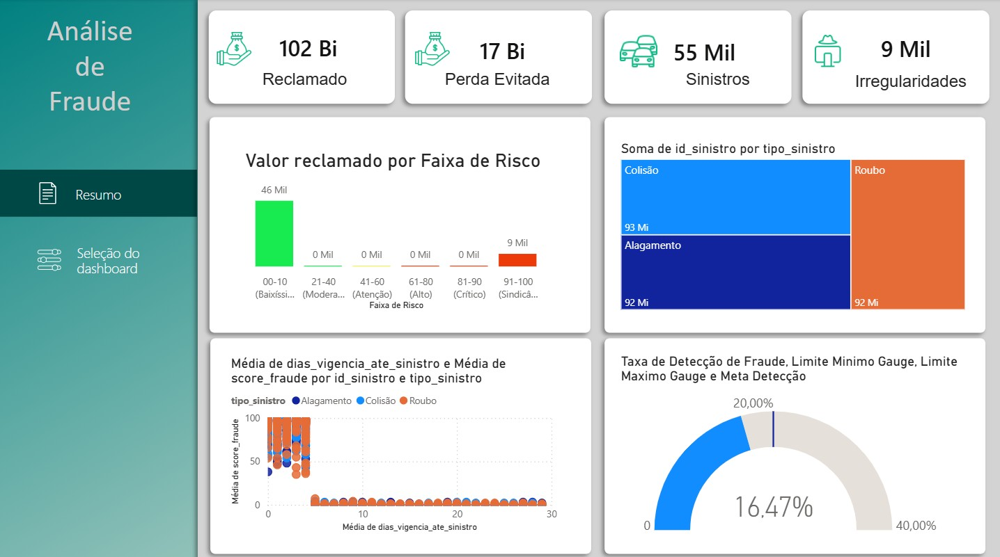
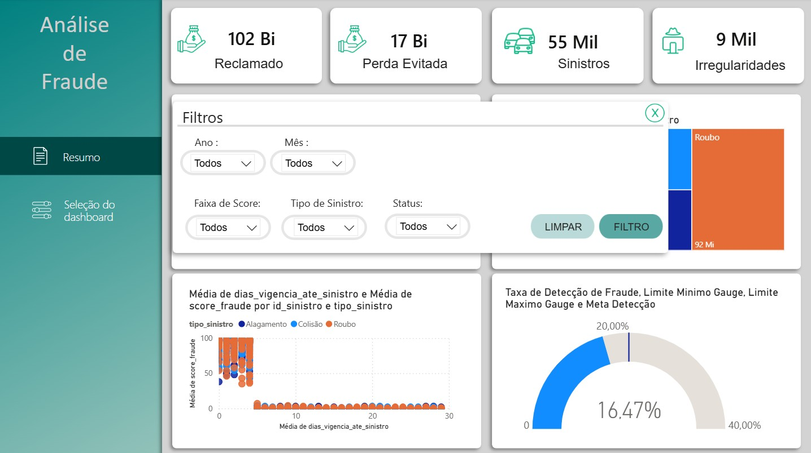

🕵️‍♂️ Fraud Analytics: Detecção Preditiva de Fraudes em Seguros
Este repositório contém um projeto fim-a-fim de ciência de dados focado na identificação de fraudes em sinistros. O projeto utiliza Python para o pipeline de dados e machine learning, e Power BI para a visualização estratégica dos resultados.

📊 Business Case
O objetivo principal é reduzir o "vazamento" financeiro, identificando sinistros suspeitos que as regras de negócio tradicionais não conseguem detectar.

Perda Evitada Potencial: R$ 17 Bilhões.

Assertividade (Hit Rate): 16,47%.

Volume Analisado: 55 mil sinistros.

## 📊 Visualização do Projeto

📁 Estrutura do Projeto
Conforme a arquitetura do repositório:

data/raw/: Contém as bases originais de apólices, sinistros, veículos e o histórico de fraudes confirmadas.

data/processed/: Armazena a base_final_priorizacao.csv gerada após o tratamento de dados e o modelo de ML, além da validação técnica (validacao_curva_roc.png).

src/:

gerador_dados.py: Script responsável pelo saneamento e cruzamento das bases brutas.

processamento_ml.py: Engine de Machine Learning que realiza o treinamento e gera o Score de Risco.

modelo_fraude_suspeita.pbix: Dashboard interativo para tomada de decisão.

Risco Seguro layout: Arquivos de design (PPTX/SVG) utilizados para a interface profissional do dashboard.

🛠️ Metodologia e Modelagem
O modelo foi treinado para identificar "assinaturas de fraude" baseando-se em:

Sinistros Prematuros: Análise do tempo entre o início da vigência e a ocorrência.

Discrepância de Valores: Cruzamento entre valores reclamados e médias históricas de mercado.

Anomalias de Participantes: Identificação de padrões de CPFs recorrentes ou suspeitos.

🚀 Como Visualizar
Os scripts em Python foram desenvolvidos no VS Code.

O output final alimenta o arquivo de Power BI, permitindo filtrar sinistros com Score > 80 para investigação prioritária pela equipe de Sindicância.

🛠️ Tecnologias Utilizadas
* **Python 3.x** (Pandas, Scikit-Learn)
* **VS Code**
* **Power BI**
* **Design de UI/UX** (PowerPoint & SVG)