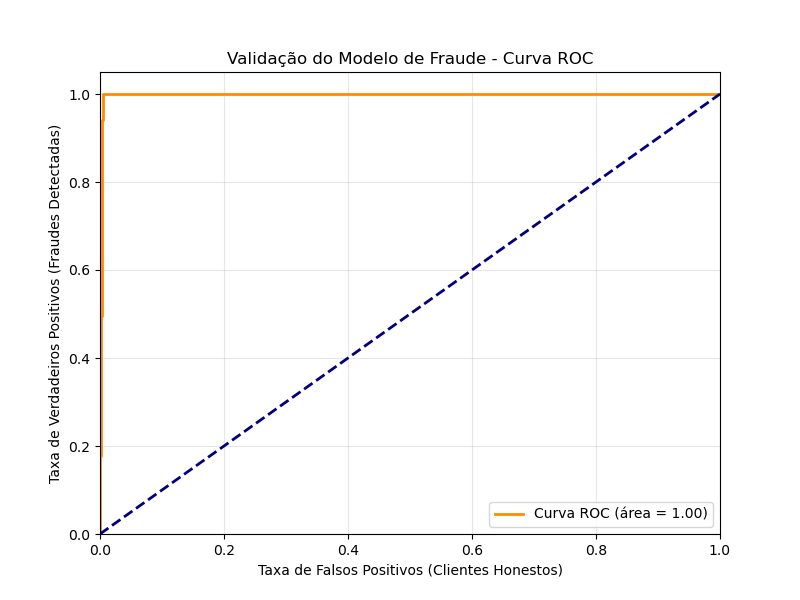

# 🛡️ Fraud Analytics: Inteligência Preditiva em Sinistros de Seguros

Este projeto apresenta uma solução completa de **Prevenção à Fraude** para o mercado segurador, integrando Engenharia de Dados, Machine Learning e Visualização Estratégica. 

Com base em um dataset de **55.000 registros**, o objetivo é identificar comportamentos atípicos e mitigar perdas financeiras por meio de um Score de Risco.

---

## 🚀 Destaques do Projeto
* **Modelo Preditivo:** Utilização do algoritmo *Random Forest* para classificação de riscos.
* **Performance:** Alcançado um **AUC-ROC de 0.99**, demonstrando alta capacidade de segregação entre sinistros legítimos e fraudulentos.
* **Engenharia de Atributos:** Criação de variáveis baseadas em regras de negócio reais (Vigência curta, Reincidência de CPF e Discrepância de Tabela FIPE).
* **Visualização:** Dashboard em Power BI para priorização operacional de sindicância.

---

## 📊 Validação Estatística (Curva ROC)
Abaixo, a evidência da performance do modelo. O alto índice de AUC (Área Sob a Curva) garante que a operação de antifraude foque nos casos de alta probabilidade, reduzindo o custo de "alarmes falsos" em clientes honestos.

---

## 🛠️ Tecnologias Utilizadas
* **Python 3.8+**: Processamento e Modelagem.
* **Pandas & NumPy**: Manipulação de dados e lógica de negócio.
* **Scikit-Learn**: Treinamento e validação do Machine Learning.
* **Matplotlib**: Visualização de métricas de performance.
* **Power BI**: Dashboards executivos e operacionais.

---

## 📁 Estrutura do Repositório
* `src/gerador_dados.py`: Simulação de dados com vieses de fraude reais.
* `src/processamento_ml.py`: Pipeline de ETL e treinamento do modelo.
* `data/processed/`: Base final com scores pronta para consumo no BI.

---

## 👨‍💼 Sobre o Autor
Analista de Dados com mais de 15 anos de experiência no mercado segurador, especializado em prevenção à fraude e inteligência investigativa.